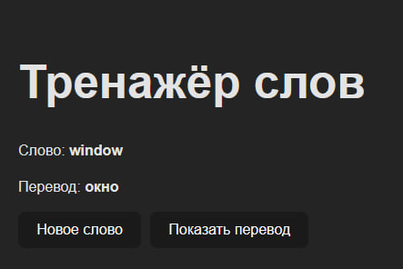
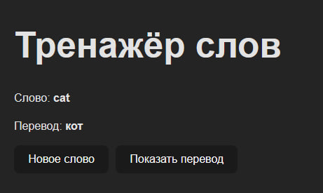

# Тренажёр слов

Небольшое React‑приложение на Vite для тренировки слов: показывается случайное английское слово и по кнопке можно открыть его русский перевод.

## Технологии

- React (функциональный компонент и хук `useState`)
- Vite для сборки и локального запуска
- JavaScript (без TypeScript)

## Как запустить локально

1. Установить Node.js (если ещё не установлен).
2. Клонировать репозиторий или скачать архив с кодом.
3. В корне проекта выполнить команды:

npm install
npm run dev

4. Открыть в браузере адрес, который покажет Vite (обычно `http://localhost:5173/`).

## Основной функционал

- Выбор случайного слова из массива слов.
- Кнопка **«Новое слово»** показывает другое случайное слово.
- Кнопка **«Показать перевод»** включает отображение перевода текущего слова.
- Простой интерфейс без лишних элементов, подходящий для учебного задания.

## Скриншоты

Главный экран с показанным переводом:

Пример другого слова:

